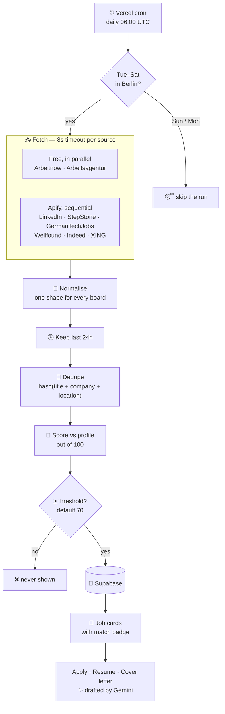

<div align="center">

# 🇩🇪 Jobportal

**Job discovery for software roles in Germany — filtered before you read it.**

Pulls eight job boards, keeps only what was posted in the last 24 hours, scores every listing
against your resume out of 100, and hides anything below your threshold.
For what's left, it drafts the CV and the cover letter.

<p>
  
  
  
  
  
</p>

[**▶ Live app**](https://jobportal-eight-lyart.vercel.app) · [How it works](#-how-it-works) · [Scoring](#-how-matching-works) · [Setup](#-getting-started)

</div>

---

## The problem

Job hunting across German boards means opening LinkedIn, StepStone, XING, Indeed, Arbeitsagentur
and three more every morning, seeing the same listing four times under different titles, and
re-reading postings you already rejected last week — because nothing remembers what you've seen.

Jobportal inverts it. The fetching, deduplicating, filtering and ranking happen on a schedule
before you sit down. What you open is a short list of jobs that are new, unique, and actually
match your profile.

## ✨ What it does

- **Eight sources, one shape.** Arbeitnow and Arbeitsagentur run free; LinkedIn, StepStone,
  GermanTechJobs, Wellfound, Indeed and XING run through Apify. Every adapter normalises into
  one `NormalizedJob` type, so the rest of the pipeline never knows where a job came from.
- **Last 24 hours only.** Recency is a filter, not a sort. Yesterday's board is gone.
- **Deduplicated across boards.** A hash over normalised title + company + location collapses the
  same role posted in four places into one card.
- **Scored out of 100** against your profile — skills, title, location, visa and seniority, each
  weighted. Below your threshold (default **70%**), it never reaches the page.
- **Three actions per job** — Apply, Create Resume, Create Cover Letter. The last two are drafted
  by **Gemini** against that specific posting, not a generic template.
- **Tue–Saturday schedule.** Berlin time. Sunday and Monday are quiet by design — German boards
  barely move over the weekend, so fetching then just burns API quota.
- **Resilient by default.** Each source gets an 8-second timeout, free sources run in parallel,
  Apify sources run sequentially to respect rate limits, and one dead board never fails the run.

## 🔄 How it works



## 🎯 How matching works

Each job earns a score out of 100 across five weighted dimensions:

| Dimension | Weight | How it's measured |
|---|---:|---|
| **Skills overlap** | 40 | Jaccard overlap between the skills in your profile and those extracted from the posting, against a 103-term dictionary |
| **Title similarity** | 20 | Normalised title compared to your target titles, with core-word overlap for near misses |
| **Location** | 15 | Your preferred locations, with remote treated as a first-class match |
| **Visa sponsorship** | 15 | Whether the posting signals sponsorship — decisive for non-EU applicants |
| **Seniority** | 10 | Posting level against your experience |

Non-software roles are filtered out before scoring by a title regex covering both English and
German forms — `software`, `entwickler`, `developer`, `engineer`, `devops`, `sre`, `architect`.

Every score ships with a **breakdown**, so a job card can tell you *why* it scored 74 rather than
just showing the number.

## 🏗 Architecture

| Layer | Path | Responsibility |
|---|---|---|
| **Sources** | `src/lib/jobs/sources/` | One adapter per board, plus `normalize.ts` into a shared shape |
| **Apify client** | `src/lib/jobs/apify-client.ts` | Six scraper-backed boards behind one interface |
| **Pipeline** | `src/lib/jobs/pipeline.ts` | Fetch → normalise → dedupe → score → persist, with per-source state |
| **Scoring** | `src/lib/jobs/scoring/` | `extract-skills.ts`, `score-job.ts`, and the skills dictionary |
| **Schedule** | `src/lib/jobs/schedule.ts` | Berlin-timezone Tue–Sat gate |
| **Cron** | `src/app/api/cron/jobs-fetch/` | Scheduled entry point, guarded by `CRON_SECRET` |
| **Generation** | `src/app/api/jobs/[id]/{resume,cover-letter}/` | Gemini-drafted documents |
| **Data** | `supabase/migrations/` | Postgres schema |
| **UI** | `src/app/jobs/` | `JobCard`, `MatchBadge`, `ContentModal` |

Source fetch state is persisted per board, so a source that fails or gets rate-limited resumes
from its own cursor on the next run instead of restarting from scratch.

## 🚀 Getting started

**Prerequisites** — Node 20+, a Supabase project, and a Gemini API key. An Apify token is optional:
without it the six scraper-backed sources are skipped and the two free boards still work.

```bash
git clone https://github.com/prakashshuklahub/Jobportal.git
cd Jobportal
npm install
cp .env.example .env.local
npm run dev
```

Apply the schema from `supabase/migrations/` before the first run.

<details>
<summary><b>Environment variables</b></summary>

<br/>

| Variable | Required | Purpose |
|---|---|---|
| `NEXT_PUBLIC_SUPABASE_URL` | ✅ | Supabase project URL |
| `NEXT_PUBLIC_SUPABASE_ANON_KEY` | ✅ | Supabase anon key |
| `SUPABASE_SERVICE_ROLE_KEY` | ✅ | Server-side writes from the pipeline |
| `GEMINI_API_KEY` | ✅ | Resume and cover-letter generation |
| `APP_PASSWORD` | ✅ | Single-user login |
| `APIFY_TOKEN` | — | The six scraper-backed sources; without it they're skipped |
| `CRON_SECRET` | prod | Guards the cron route |

</details>

<details>
<summary><b>Sources and their tiers</b></summary>

<br/>

| Source | Phase | Needs Apify |
|---|:---:|:---:|
| Arbeitnow | 1 | — |
| Arbeitsagentur | 1 | — |
| LinkedIn | 1 | ✅ |
| StepStone | 1 | ✅ |
| GermanTechJobs | 1 | ✅ |
| Wellfound | 1 | ✅ |
| Indeed Germany | 2 | ✅ |
| XING Jobs | 2 | ✅ |

Sources are individually toggleable per user in Settings.

</details>

## 📚 Documentation

The full MVP feature specification — portal-by-portal sourcing feasibility, scoring rules and the
data model — is in **[docs/SPEC.md](docs/SPEC.md)**.

---

<div align="center">

Built by **[Prakash Shukla](https://github.com/prakashshuklahub)**

[The Hustling Engineer](https://www.youtube.com/@TheHustlingEngineer) · [LinkedIn](https://www.linkedin.com/in/prakash-shukla/)

</div>
